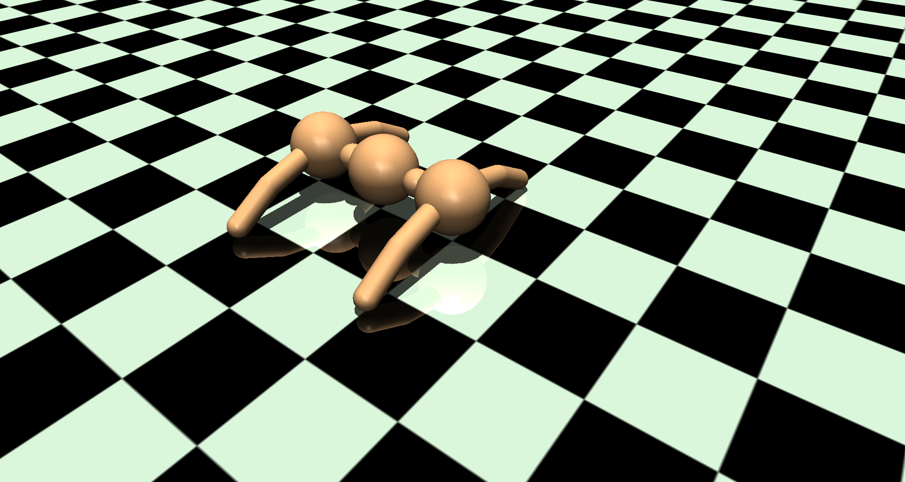

# GeckoEnvironment

GeckoEnvironment is a Gym-Mujoco custom environment to simulate a gecko-like robot.

<p align="center">
    
</p>

## Getting Started

### Prerequisites

```
python 3.11.5
gymnasium 0.29.1
imageio 2.31.6
mujoco 3.0.0
numpy 1.26.1
```

### Installation

Start by cloning the repository and move in the new directory:
```
git clone https://github.com/z-Zel/GeckoEnvironment.git && cd GeckoEnvironment
```

Install the requirements:
```
python -m pip install -r requirements.txt 
```

### Visualisation

A simple script is provided to visualise the environment, use the following command to run it:
```
python script.py
```

## Acknowledgments

- [Gymnasium](https://github.com/Farama-Foundation/Gymnasium)
- [Mujoco](https://github.com/google-deepmind/mujoco)